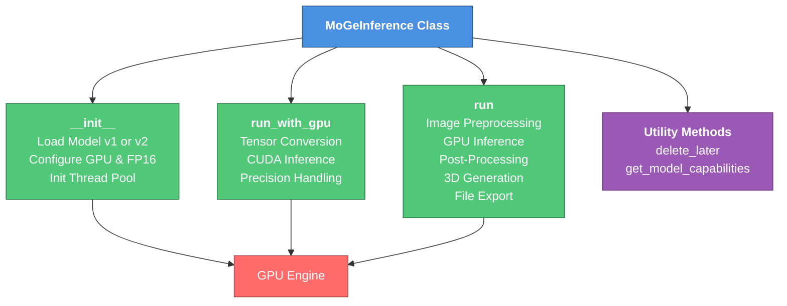
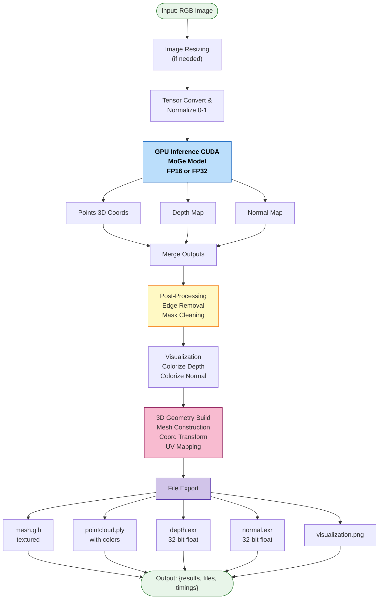

# Inference Processing Documentation

## Overview

The `inference.py` module implements the `MoGeInference` class, which encapsulates the depth estimation pipeline using the MoGe model. It handles model loading, GPU-accelerated inference, post-processing, and 3D geometry generation (meshes and point clouds).

## Architecture Diagram



## Processing Flow Diagram



## Key Components

### MoGeInference Class

The main inference engine with the following responsibilities:

#### Method Signatures

```python
class MoGeInference:
    # Constructor
    def __init__(
        self, 
        pretrained_model_name_or_path: str, 
        model_version: str, 
        use_fp16: bool
    ) -> None

    # Main inference method
    def run(
        self,
        image: np.ndarray,
        max_size: int = 800,
        resolution_level: str = 'High',
        apply_mask: bool = True,
        remove_edge: bool = True,
        produce_depth: bool = True,
        produce_normal: bool = True,
        enable_download: bool = True
    ) -> Dict[str, Any]

    # Low-level GPU inference
    @gpu_decorator
    def run_with_gpu(
        self,
        image: np.ndarray,
        resolution_level: int,
        apply_mask: bool
    ) -> Dict[str, np.ndarray]

    # Utility methods
    def delete_later(
        self,
        path: Union[str, os.PathLike],
        delay: int = 300
    ) -> None

    def get_model_capabilities(self) -> Dict[str, bool]
```

#### Initialization (`__init__`)

- Loads the pre-trained MoGe model based on the specified version (v1 or v2).
- Automatically selects a default pre-trained model if none is provided.
- Configures GPU acceleration and optional FP16 precision for faster inference.
- Initializes a thread pool executor for asynchronous file cleanup tasks.

**Parameters:**
- `pretrained_model_name_or_path`: Model identifier or local path (defaults to official pre-trained models).
- `model_version`: Model version string ('v1' or 'v2').
- `use_fp16`: Boolean flag to enable half-precision floating-point computation.

#### GPU-Accelerated Inference (`run_with_gpu`)

- Converts input image to tensor format and normalizes pixel values (0-255 → 0-1).
- Executes the MoGe model on CUDA to generate depth, normal, and mask outputs.
- Handles mixed precision computation when FP16 is enabled.
- Returns results as NumPy arrays on the CPU.

**Input:**
- `image`: RGB image as NumPy array.
- `resolution_level`: Integer controlling inference resolution (0-30).
- `apply_mask`: Boolean to apply segmentation masking.

**Output:**
- Dictionary with keys:
  - `points`: 3D point coordinates.
  - `depth`: 2D depth map (if available).
  - `normal`: 2D normal map (if available).
  - `mask`: Binary segmentation mask.

#### Main Processing Pipeline (`run`)

High-level inference function orchestrating the entire pipeline:

1. **Image Preprocessing:**
   - Resizes the image if its longest dimension exceeds `max_size`.
   - Uses area-based interpolation to preserve quality.

2. **Resolution Configuration:**
   - Maps resolution level strings ('Low', 'Medium', 'High', 'Ultra') to inference parameters (0, 5, 9, 30).

3. **GPU Inference:**
   - Calls `run_with_gpu` to perform model inference.
   - Generates depth, normal, and mask outputs.

4. **Post-Processing:**
   - Optionally removes edge artifacts from depth maps using occlusion-sensitive edge detection.
   - Cleans masks based on edge information.
   - Provides options to disable depth or normal output if not needed.

5. **Visualization:**
   - Colorizes depth maps for visual inspection.
   - Colorizes normal maps using color-mapped visualization.

6. **3D Geometry Generation:**
   - Builds a triangulated mesh from point clouds, depth, and normal information.
   - Associates vertex colors with the original image texture.
   - If normals are available, embeds them in the mesh.
   - Performs coordinate system transformation (right-hand to left-hand convention).
   - Adjusts UV coordinates for proper texture mapping.

7. **File Export:**
   - Exports 3D data in multiple formats:
     - **mesh.glb**: Textured 3D mesh in glTF binary format with PBR material properties.
     - **pointcloud.ply**: Colored point cloud with normal vectors.
     - **depth.exr**: 32-bit floating-point depth map (OpenEXR format).
     - **normal.exr**: RGB normal map (OpenEXR format).
     - **depth_vis.png**: Colorized depth visualization (PNG).
     - **normal_vis.png**: Colorized normal visualization (PNG).
   - Stores files in a temporary directory with automatic cleanup scheduling.

**Parameters:**
- `image`: Input RGB image (NumPy array).
- `max_size`: Maximum dimension threshold for resizing (default: 800).
- `resolution_level`: Inference resolution ('Low', 'Medium', 'High', 'Ultra').
- `apply_mask`: Enable segmentation mask application.
- `remove_edge`: Enable edge removal in depth maps.
- `produce_depth`: Include depth map in output.
- `produce_normal`: Include normal map in output.
- `enable_download`: Export files for download.

**Return Value:**
- Dictionary containing:
  - Inference results (depth, normal, points, mask).
  - Processed outputs (mask_cleaned).
  - Visualizations (depth_vis, normal_vis).
  - File paths for exported 3D assets.
  - Processing timing information.

### Utility Methods

#### `delete_later(path, delay)`

Schedules asynchronous file deletion after a specified delay (default: 300 seconds).
- Useful for cleaning up temporary output files without blocking the inference pipeline.
- Uses a background thread pool for non-blocking deletion.

## Model Versions

The module supports two MoGe model versions:

- **v1**: `Ruicheng/moge-vitl` – Earlier version for general depth estimation.
- **v2**: `Ruicheng/moge-2-vitl-normal** – Improved model with better normal map generation.

## Performance Considerations

- **GPU Acceleration:** Requires CUDA-capable GPU with sufficient VRAM.
- **FP16 Mode:** Reduces memory footprint and computation time (~2x faster on compatible hardware).
- **Resolution Levels:** Higher levels improve accuracy but increase inference time.
- **Batch Processing:** Currently processes single images; thread pool handles cleanup tasks asynchronously.

## Output File Formats

| Format | Purpose | Precision |
|--------|---------|-----------|
| GLB    | 3D textured mesh | Single (RGB texture) |
| PLY    | Point cloud with colors and normals | Single |
| EXR    | Depth/normal maps | 32-bit float |
| PNG    | Visualizations | 8-bit per channel |

## Dependencies

- **torch**: GPU tensor computation.
- **OpenCV** (cv2): Image preprocessing.
- **trimesh**: 3D mesh and point cloud handling.
- **PIL**: Image texture processing.
- **utils3d**: 3D geometry utilities for mesh construction.
- **moge**: The MoGe model implementation (Microsoft's official package).
- **spaces** (optional): Hugging Face Spaces GPU acceleration decorator.

## Error Handling

- Gracefully handles missing optional dependencies (e.g., Hugging Face Spaces).
- File deletion errors are silently ignored if temporary files are already removed.
- GPU memory is automatically managed through PyTorch's tensor lifecycle.
